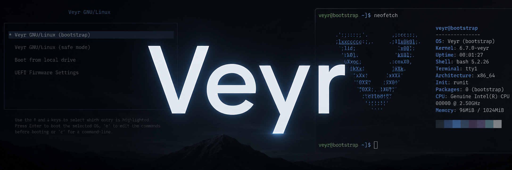

<p align="center">
  
</p>

<p align="center"><strong>An independent Linux distribution built from upstream components.</strong></p>

<p align="center">
  <em>Current stage: Bootstrap + Forge prototype</em>
</p>

---

## About

**Veyr** is a personal Linux distribution project focused on building a fully independent system from upstream components instead of using Fedora, Ubuntu, or Arch as a base.

The long-term goal is to develop a shared **Veyr Base** and ship two editions on top of it:

- **Veyr Desktop** — a polished, user-friendly edition for everyday users.
- **Veyr Developer** — a development-focused edition with tools and workflows for programmers.

Right now the project is in the **bootstrap** phase and already includes:

- a bootable ISO,
- an upstream Linux kernel build,
- a static BusyBox bootstrap userspace,
- a custom build orchestrator called **Veyr Forge**,
- package manifests and profile manifests,
- QEMU/KVM testing workflow.

---

## Current status

### Released milestones

- **0.0.1** — bootstrap proof of concept
- **0.0.2** — Forge prototype

### Current profile

The active image profile right now is:

- **bootstrap** — minimal development image used to validate the Veyr build pipeline.

Planned profiles:

- **base**
- **desktop**
- **developer**

---

## Repository structure

```text
veyr/
├── config/
├── docs/
├── initramfs/
├── iso/
├── packages/
│   ├── core/
│   ├── desktop/
│   └── developer/
├── profiles/
├── rootfs/
├── scripts/
├── tools/
│   └── forge/
├── build/
├── sources/
├── out/
└── veyr
```

---

## Key concepts

### Veyr Forge

**Veyr Forge** is the custom build orchestration tool for Veyr.

It currently supports:

- declarative `package.toml` manifests,
- declarative `profile.toml` manifests,
- package dependency graph resolution,
- source downloading,
- SHA-256 verification,
- source extraction,
- package build orchestration,
- build output validation,
- simple build cache/fingerprints,
- bootstrap image assembly.

---

## Build requirements

The current build host is **Fedora Linux**.

Recommended packages are installed via:

```bash
make deps
```

Then verify the host:

```bash
./veyr doctor
```

---

## Quick start

### 1. Install host dependencies

```bash
make deps
```

### 2. Check the build environment

```bash
./veyr doctor
```

### 3. Inspect packages and profiles

```bash
./veyr list packages
./veyr list profiles
./veyr graph bootstrap
```

### 4. Build the bootstrap image

```bash
./veyr image bootstrap
```

### 5. Run it in QEMU/KVM

```bash
./veyr run bootstrap
```

---

## Useful commands

### Show version

```bash
./veyr --version
```

### Show package info

```bash
./veyr info package linux
./veyr info package busybox
```

### Show profile info

```bash
./veyr info profile bootstrap
```

### Download sources only

```bash
./veyr fetch --profile bootstrap
```

### Build specific packages

```bash
./veyr build busybox
./veyr build linux
```

### Force rebuild

```bash
./veyr image bootstrap --rebuild
```

### Clean generated artifacts

```bash
./veyr clean
```

### Clean everything including sources

```bash
./veyr clean --sources
```

---

## Output locations

### Package outputs

```text
out/packages/busybox/
out/packages/linux/
```

### Image outputs

```text
out/images/bootstrap/
├── initramfs.img
└── Veyr-<version>-bootstrap-x86_64.iso
```

---

## Testing workflow

At the current stage, Veyr is tested in **QEMU/KVM**.

Recommended testing loop:

1. build the image,
2. boot it in QEMU,
3. verify the shell starts,
4. run:
   - `uname -a`
   - `cat /etc/os-release`
   - `ps`
   - `dmesg`
5. power off and iterate.

Later stages will add:

- persistent installation,
- virtual disk testing,
- upgrade testing,
- hardware testing.

---

## Screenshots to add later

Recommended real screenshots for the repository:

1. **GRUB / boot menu** — first Veyr entry selection.
2. **Bootstrap shell** — the initial Veyr shell prompt after boot.
3. **Forge CLI** — `./veyr list profiles` and `./veyr graph bootstrap`.
4. **Forge build** — `./veyr image bootstrap` in progress.
5. **Future**: Veyr Desktop screenshots when Plasma is ready.

For now the repository already includes a branding banner:

- `assets/banner/veyr-banner.png`

You can later replace or extend it with real screenshots from QEMU.

---

## Branding assets included

This archive includes:

- `assets/banner/veyr-banner.png`
- `assets/icons/veyr-mark.svg`
- `assets/icons/veyr-wordmark.svg`

You can use them in:

- GitHub README,
- release notes,
- project website,
- future installer and system branding.

---

## Planned direction

### Short-term

- finish the Forge prototype,
- validate bootstrap image generation through Forge,
- publish the repository,
- begin `0.1 Veyr Base`.

### Mid-term

- bootstrap toolchain,
- glibc,
- bash,
- coreutils,
- systemd,
- persistent root filesystem,
- package repository groundwork.

### Long-term

- **Veyr Desktop** with KDE Plasma,
- graphical software installation,
- graphical updates,
- Windows-familiar UX,
- **Veyr Developer** on top of shared Veyr Base.

---

## Roadmap

See: [`docs/ROADMAP.md`](docs/ROADMAP.md)

---

## License

At the moment, the repository can be published with the **MIT License** for the Veyr project files (scripts, tooling, manifests, documentation).

Note that Veyr builds and redistributes many upstream components that keep their own licenses.

---

## Suggested GitHub repository metadata

### Repository name

```text
veyr
```

### Suggested description

```text
An independent Linux distribution built from upstream components, featuring a custom build system called Veyr Forge.
```

### Suggested topics

```text
linux distribution distro linux-from-scratch operating-system kernel build-system qemu system-programming busybox toolchain forge
```

---

## Author note

Veyr is currently a personal long-term systems project.
The goal is not just to theme an existing distro, but to build a real independent Linux distribution step by step.
